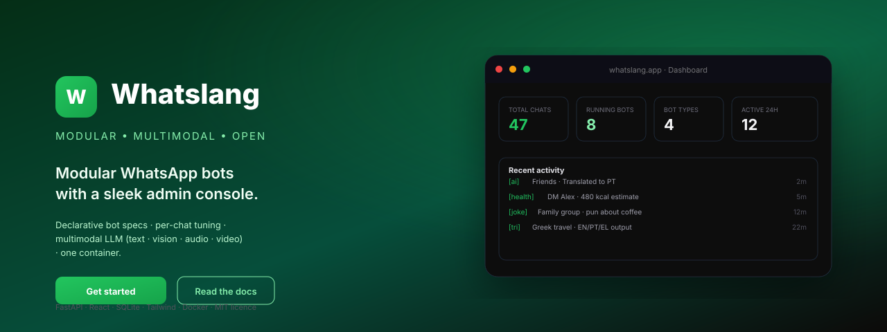

<!-- markdownlint-disable MD033 MD041 -->
<p align="center">
  
</p>

<h1 align="center">Whatslang</h1>

<p align="center">
  <strong>Modular, multimodal WhatsApp bots with a sleek admin console.</strong><br>
  Declarative bot specs · multimodal LLM (text · vision · audio · video) · per-chat tuning · single container.
</p>

<p align="center">
  <a href="#-quick-start"></a>
  
  
  
  
  
  
</p>

<p align="center">
  <a href="USAGE.md">Usage guide</a> ·
  <a href="docs/architecture.md">Architecture</a> ·
  <a href="docs/bots.md">Writing bots</a> ·
  <a href="docs/configuration.md">Configuration</a> ·
  <a href="docs/deployment.md">Deployment</a> ·
  <a href="docs/api.md">REST API</a> ·
  <a href="docs/security.md">Security</a> ·
  <a href="docs/troubleshooting.md">Troubleshooting</a>
</p>

---

## Why Whatslang?

> Most WhatsApp-bot frameworks ask you to wire threads, polling loops, media
> pipelines, and a UI from scratch. **Whatslang** gives you all of that in one
> small FastAPI process — and lets you ship a new bot by writing a *single*
> dataclass.

<table>
  <tr>
    <td width="50%" valign="top">

### Bot author experience

```python
register(
    BotSpec(
        name="echo",
        label="Echo",
        prefix="[echo]",
        emoji="🔁",
        description="Repeats whatever you say.",
        text_system_prompt=(
            "You are a polite echo. "
            "Repeat the user's text verbatim."
        ),
    )
)
```

That's the whole bot. Threading, polling, deduplication,
self-message gating, response splitting, image/audio/video,
per-chat overrides — all handled by the runner.

</td>
    <td width="50%" valign="top">

### Operator experience

- **Dashboard** with KPIs, recent activity, and bot status
- **Chats list** with search, filters, sort, pagination, bulk actions
- **Per-chat bot management** — toggle bots, configure context size,
  redirect responses to another chat
- **Live diagnostics** for the gateway, LLM, database, and bot runtime
- **Logs modal** with the last N events for any (bot, chat) pair
- **Dark mode**, toasts, modals, optimistic UI

</td>
  </tr>
</table>

---

## ✨ Highlights

| | |
|---|---|
| **🧩 Declarative bots** | A bot is a `BotSpec` — name, prefix, system prompt, optional image/audio modes. The runner does the rest. |
| **🎙 Multimodal** | Text, image (vision), audio (Whisper), and video → audio transcription handled in one place. |
| **👥 Multiple bots per chat** | Run any combination of bots per chat. Each has its own context size, self-answer toggle, and optional response redirect. |
| **🛡 Hardened by default** | Single-user auth, HMAC-signed `SameSite=Strict` cookies, login throttling, strict JID allow-list, path-traversal-safe SPA serving, security headers, redacted error bodies. See [`docs/security.md`](docs/security.md) and [`SECURITY.md`](SECURITY.md). |
| **🪶 One container** | Vite builds the SPA, FastAPI serves it from `/web/dist`. No Nginx, no separate API gateway. |
| **🚀 PaaS-ready** | Ships with `Dockerfile`, `docker-compose.yml`, `nixpacks.toml`, **and** `railpack.json`. |
| **🔍 Live diagnostics** | `/api/diagnostics` and an in-app page show gateway latency, LLM config, DB stats, recent errors. |
| **🧠 LLM-agnostic** | Any OpenAI-compatible endpoint — OpenAI, Azure OpenAI, LiteLLM, vLLM, llama.cpp's openai server. |

---

## 🖼 The dashboard at a glance

<table>
  <tr>
    <td align="center" colspan="2"><strong>Dashboard — light & dark</strong></td>
  </tr>
  <tr>
    <td></td>
    <td></td>
  </tr>
  <tr>
    <td align="center"><strong>All chats — searchable, sortable, paginated</strong></td>
    <td align="center"><strong>Per-chat bot management</strong></td>
  </tr>
  <tr>
    <td></td>
    <td></td>
  </tr>
  <tr>
    <td align="center"><strong>Bots catalog</strong></td>
    <td align="center"><strong>Live diagnostics</strong></td>
  </tr>
  <tr>
    <td></td>
    <td></td>
  </tr>
  <tr>
    <td align="center"><strong>Per-bot settings</strong></td>
    <td align="center"><strong>Per-bot live logs</strong></td>
  </tr>
  <tr>
    <td></td>
    <td></td>
  </tr>
</table>

> The full walkthrough — including login, settings, and what bots look like
> from the WhatsApp side — lives in **[USAGE.md](USAGE.md)**.

---

## 🚀 Quick start

### 0. Stand up a WhatsApp gateway

Whatslang doesn't talk to WhatsApp directly. It speaks REST to a
`whatsapp-mcp` / `wha-mcp`-compatible gateway that you bring yourself.
Any service that exposes `GET /chats`, `GET /messages`, `POST /send`,
`GET /download/...` will do.

### 1. Configure

```bash
cp .env.example .env
$EDITOR .env
```

You need at minimum:

- `WHATSAPP_BASE_URL` (and credentials, if your gateway requires them)
- `OPENAI_API_KEY` (any LiteLLM-compatible endpoint via `OPENAI_BASE_URL` works too)
- `DASHBOARD_PASSWORD` (and ideally `SESSION_SECRET`). The service refuses
  to boot in `ENVIRONMENT=production` without them.

See [docs/configuration.md](docs/configuration.md) for every variable and
[docs/security.md](docs/security.md) for the operator checklist.

### 2. Run the backend (Python 3.10+)

```bash
python3 -m venv .venv
source .venv/bin/activate
pip install -r requirements.txt
python -m app                       # http://localhost:8000
```

The interactive API docs live at `http://localhost:8000/api/docs` when
`ENVIRONMENT=development`.

### 3. Run the frontend (Node 20+)

```bash
cd web
npm install
npm run dev                         # http://localhost:5173 (proxies /api → :8000)
```

For production, run `npm run build` once — FastAPI auto-serves `web/dist/`.

### 4. Or, just one command

```bash
docker compose up --build
```

The compose file mounts a `whatslang-data` volume to `/data` so SQLite
state survives upgrades. The container exposes `/health` for orchestrators.

> Need PaaS? `nixpacks.toml` and `railpack.json` are both committed —
> see [docs/deployment.md](docs/deployment.md).

---

## 🤖 Built-in bot catalog

| Emoji | Name | Prefix | What it does |
|---|---|---|---|
| 🌐 | `translation` | `[ai]` | EN ↔ PT translator. Auto-detects source language. Handles text, OCR on images, voice notes (Whisper), and video audio tracks. |
| 🇧🇷🇬🇷 | `trilingual_en_pt_el` | `[tri]` | English → BOTH Portuguese (BR) and Greek; anything else → English. Multimodal. |
| 😂 | `joke` | `[joke]` | Replies with a short, family-friendly joke matching the user's language. Text-only. |
| 🥗 | `health_coach` | `[health]` | Empathic but honest coach. Estimates kcal & macros from food photos. Transcribes voice notes. |

A bot can be started in any chat, configured per chat, and stopped — without
restarting the server.

<p align="center">
  
</p>

---

## 🧩 Adding a new bot

Edit `app/bots/__init__.py`:

```python
from app.bots.base import BotSpec, MediaMode, register

register(
    BotSpec(
        name="echo",
        label="Echo",
        prefix="[echo]",
        emoji="🔁",
        description="Repeats whatever you say.",
        text_system_prompt=(
            "You are a polite echo. "
            "Repeat the user's text verbatim."
        ),
        # Optional: enable image OCR/vision by setting an image_prompt.
        # image_prompt="Describe this image in one sentence.",
        # Optional: how to handle voice notes / video audio tracks.
        # media_mode=MediaMode.IGNORE,
    )
)
```

Restart the server. The bot shows up in the dashboard and is ready
to assign to any chat.

The full reference — every field, every `MediaMode`, prompt cookbook,
and how to subclass `BotRunner` for custom logic — is in
**[docs/bots.md](docs/bots.md)**.

---

## 🏗 Architecture

<p align="center">
  
</p>

A single FastAPI process:

1. Serves the React SPA from `web/dist`.
2. Talks to a WhatsApp gateway over REST.
3. Talks to an OpenAI-compatible LLM (text · vision · Whisper).
4. Persists state in a single SQLite file on a mounted volume.
5. Runs a small thread per `(bot, chat)` pair, managed by the `BotManager`.

For per-message details, see [docs/architecture.md](docs/architecture.md).

---

## 📂 Project layout

```text
app/
  config.py            pydantic-settings config
  logging_setup.py     pretty/JSON logging
  db.py                SQLite repository (compatible with old schema)
  auth.py              HMAC-signed session cookies
  schemas.py           Pydantic request/response models
  deps.py              FastAPI dependency providers
  main.py              app factory + SPA mount + lifespan
  routers/             auth · bots · chats · system
  services/            whatsapp · llm · bot_manager
  bots/
    base.py            BotSpec, MediaMode, generic BotRunner
    __init__.py        Declarative bot catalog
web/
  src/
    api/               typed fetch client + endpoints
    components/        AppShell, Sidebar, TopBar, primitives
    lib/               theme, toast, auth context, utils
    pages/             Dashboard, Chats, ChatDetail, Bots, Settings, Login
docs/                  Long-form documentation + screenshots
```

---

## 📚 Documentation

| Doc | What's inside |
|---|---|
| [USAGE.md](USAGE.md) | End-to-end walkthrough with screenshots — first login, sync, start a bot, tune it. |
| [docs/architecture.md](docs/architecture.md) | Process model, threading, per-message lifecycle, persistence. |
| [docs/bots.md](docs/bots.md) | Full `BotSpec` reference, `MediaMode` enum, prompt cookbook, custom runners. |
| [docs/configuration.md](docs/configuration.md) | Every environment variable, with examples and defaults. |
| [docs/deployment.md](docs/deployment.md) | Docker, Nixpacks, Railpack, bare metal, reverse proxies, healthchecks. |
| [docs/api.md](docs/api.md) | Full REST API reference — every endpoint, request and response shape. |
| [docs/security.md](docs/security.md) | Threat model, defences, operator checklist. **Read before going live.** |
| [SECURITY.md](SECURITY.md) | Security policy and how to report vulnerabilities. |
| [docs/troubleshooting.md](docs/troubleshooting.md) | Symptom → cause → fix table. |
| [CONTRIBUTING.md](CONTRIBUTING.md) | Local setup and quality bar (ruff, tsc, vite build). |

---

## 🧪 Quality

```bash
make lint           # ruff check on app/
make typecheck      # tsc -b --noEmit in web/
make check          # both of the above
```

A `pytest` test suite under `tests/` covers the security model end-to-end
(see [`docs/security.md`](docs/security.md)). CI runs `lint` +
`typecheck` + `pytest` + `web build` on every push.

```bash
source .venv/bin/activate
pytest                       # 35 tests; full security regressions
```

Documentation screenshots are built from `scripts/build_docs_images.py`:

```bash
source .venv/bin/activate
python scripts/build_docs_images.py    # regenerates docs/images/*.svg
```

---

## 📜 License

MIT — see `LICENSE`. Built with care, made to be hacked on.
