# Whatslang — Usage Guide

A guided tour of the admin console, from first login to a chat happily
talking to four bots in three languages. Each step has a screenshot, the
underlying API call, and a few power-user tips.

> Prefer to skim? See the [README](README.md) for the elevator pitch and
> [docs/api.md](docs/api.md) for the raw REST surface.

---

## Table of contents

1. [Before you start](#before-you-start)
2. [Step 1 — Log in](#step-1--log-in)
3. [Step 2 — Take in the dashboard](#step-2--take-in-the-dashboard)
4. [Step 3 — Sync your chats](#step-3--sync-your-chats)
5. [Step 4 — Browse and filter chats](#step-4--browse-and-filter-chats)
6. [Step 5 — Start a bot in a chat](#step-5--start-a-bot-in-a-chat)
7. [Step 6 — Tune a bot per chat](#step-6--tune-a-bot-per-chat)
8. [Step 7 — Read live logs](#step-7--read-live-logs)
9. [Step 8 — What it looks like in WhatsApp](#step-8--what-it-looks-like-in-whatsapp)
10. [Step 9 — Manage the bot catalog](#step-9--manage-the-bot-catalog)
11. [Step 10 — Diagnostics](#step-10--diagnostics)
12. [Step 11 — Settings & themes](#step-11--settings--themes)
13. [Power tips](#power-tips)
14. [Common workflows](#common-workflows)

---

## Before you start

You'll need:

- A running WhatsApp gateway (e.g. `whatsapp-mcp`) reachable from the
  Whatslang process.
- An OpenAI-compatible API key.
- The Whatslang server running, either via `docker compose up` or
  `python -m app` after `pip install -r requirements.txt`.

If anything is missing the **Diagnostics** page will tell you exactly
what (see [Step 10](#step-10--diagnostics)). For the full env-var
reference see [docs/configuration.md](docs/configuration.md).

---

## Step 1 — Log in

  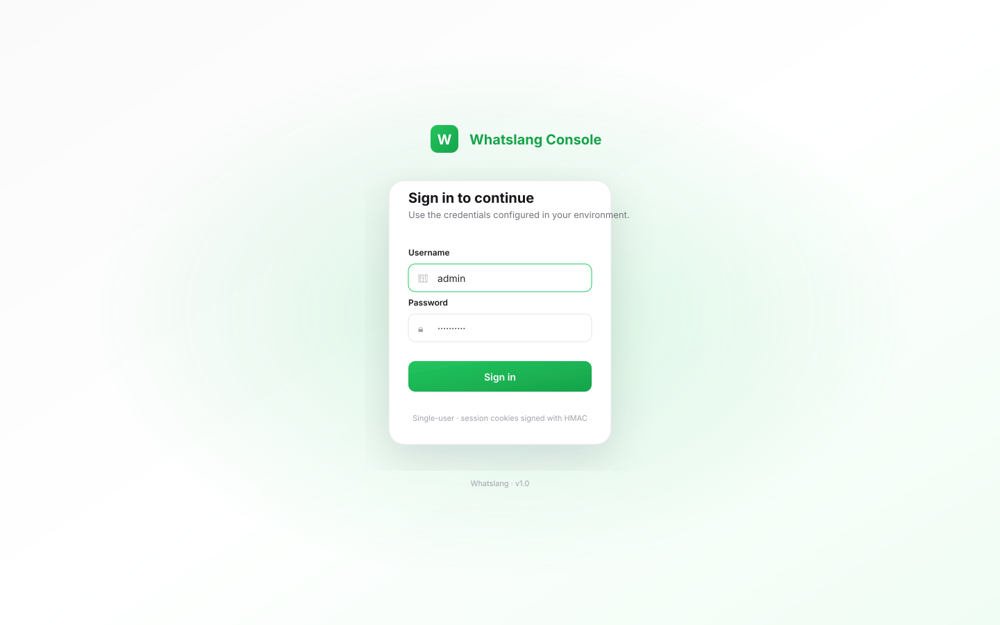

Open `http://localhost:8000` (or wherever you deployed) and sign in with
the credentials you set via `DASHBOARD_USER` and `DASHBOARD_PASSWORD`.

> Leave both env vars blank in `.env` and the entire UI is open — useful
> behind a private network or a reverse-proxy that handles auth.

**Under the hood:** `POST /api/auth/login` issues an HMAC-signed
`whatslang_session` cookie. The session lives for 7 days by default
(`session_max_age_seconds` in `app/config.py`).

---

## Step 2 — Take in the dashboard

  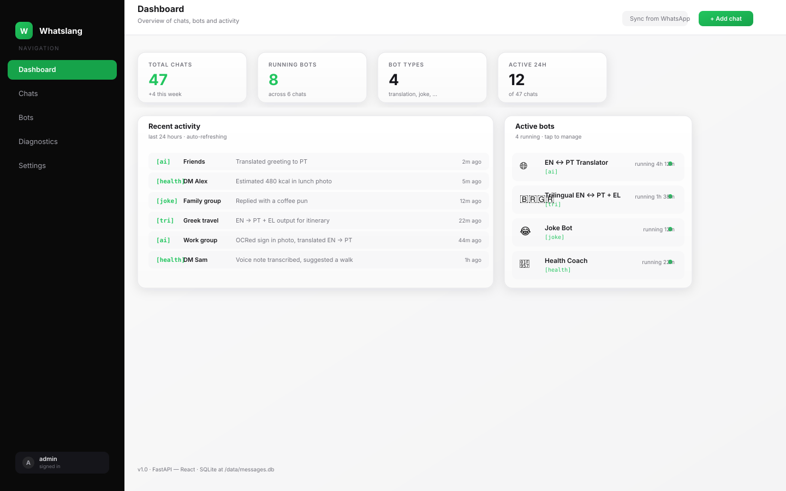

The dashboard is the main "is everything OK?" view:

- **Total chats** — every chat that's been synced or added manually.
- **Running bots** — total `(bot, chat)` pairs currently spinning a thread.
- **Available bot types** — size of the declarative bot catalog.
- **Active chats (24 h)** — chats with new traffic in the last day.
- **Recent activity** — last messages we observed, with the bot prefix
  visible so you can tell which bot replied.
- **Active bots** — quick links into chat detail.

It works just as well in dark mode if that's your thing:

  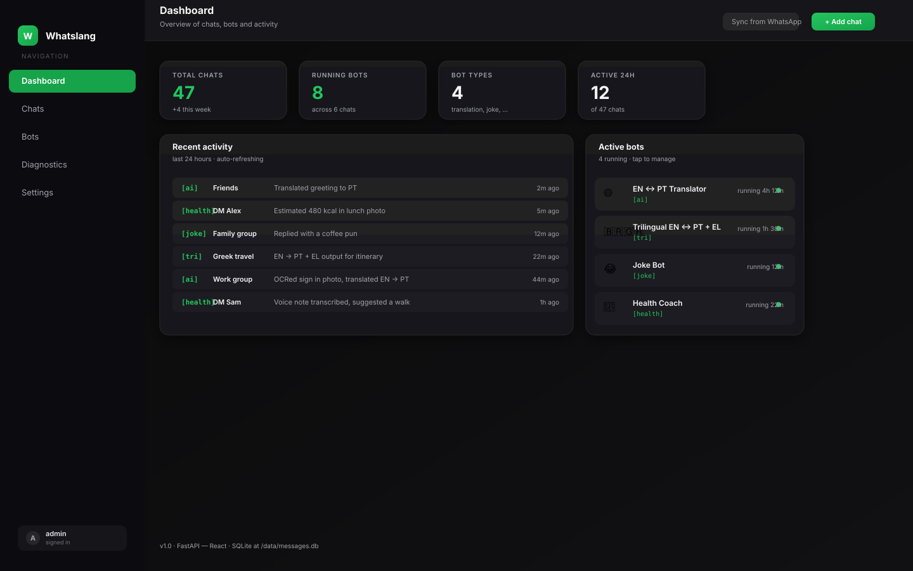

**Under the hood:**

- `GET /api/stats` — the four KPI numbers.
- `GET /api/chats?per_page=5&sort=last_message_time&order=desc` — recent activity.
- `GET /api/bots` — running bots.

---

## Step 3 — Sync your chats

The very first time the database is empty. Click **Sync from WhatsApp**
in the top bar (or hit `POST /api/chats/sync`) and Whatslang will:

1. Pull groups from `GET /groups`.
2. Pull individual chats from `GET /chats`.
3. Pull contacts from `GET /contacts` to backfill display names.
4. Re-resolve any chat that's still showing only its JID.

You'll get a toast like `Synced 14 group(s) and 32 individual chat(s)`.
Repeat any time — it's idempotent.

> **Tip.** You can also add chats manually with **+ Add chat** if you
> want to seed a single JID without a full sync (handy for testing).

---

## Step 4 — Browse and filter chats

  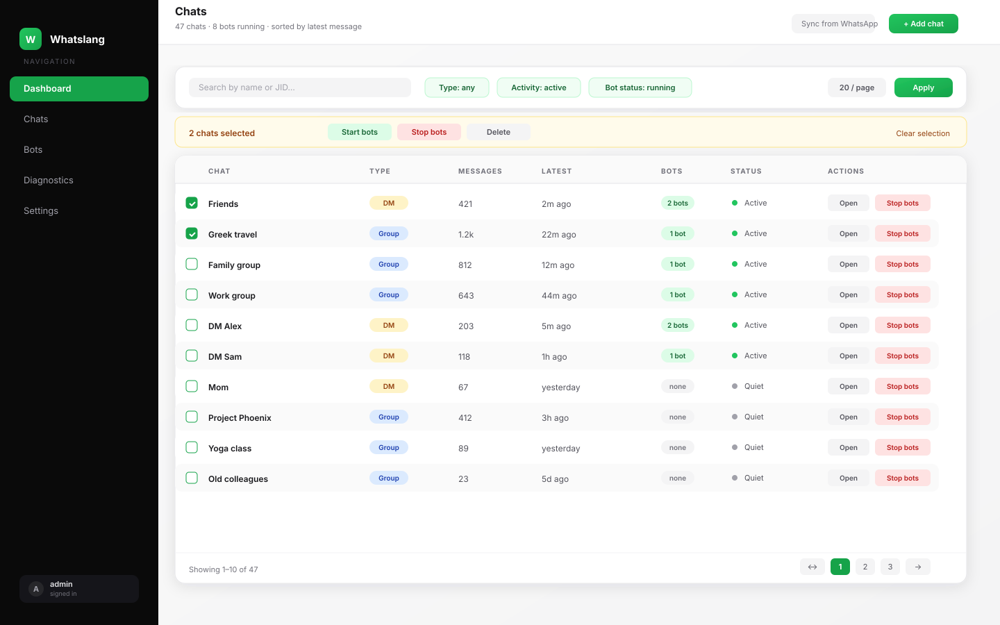

The **Chats** page is built for scale:

- **Search** by name or JID, debounced.
- **Filters** — chat type (group / DM), activity (active / quiet),
  bot status (running / stopped).
- **Sort** by name, message count, last message time.
- **Pagination** — pick page size (10 / 20 / 50 / 100).
- **Bulk actions** — select with the checkboxes, then "Stop bots",
  "Resume", or "Delete" the lot.

**Under the hood:** `GET /api/chats?page=1&per_page=20&sort=…&filters…`
returns `{ chats: ChatWithBots[], pagination: {…} }`. Bulk actions
fan out via `POST /api/chats/bulk` with `action ∈ {start_bots,
stop_bots, delete_chats}`.

---

## Step 5 — Start a bot in a chat

Click any chat row to open the **Chat detail** page:

  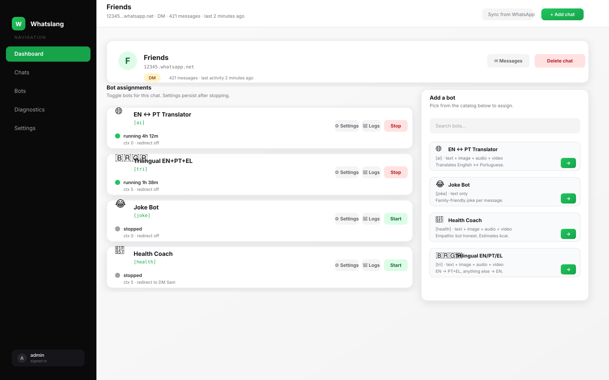

You'll see:

- **Chat info** — name, JID, type, when we last saw activity.
- **Bot assignments** — every bot that's been assigned here, running or
  stopped.
- **Add a bot** — pick from the catalog and click ▶ to start.

Hit **Start** on the picker and a thread spins up for that
`(bot, chat)` pair. The card immediately flips to a green dot with
"Running 0s".

**Under the hood:** `POST /api/bots/{name}/start?chat_jid=…`. The
`BotManager` checks if a thread already exists, creates one if not, and
persists the assignment so it auto-resumes on restart.

---

## Step 6 — Tune a bot per chat

Each bot card has a small ⚙ button. It opens this modal:

  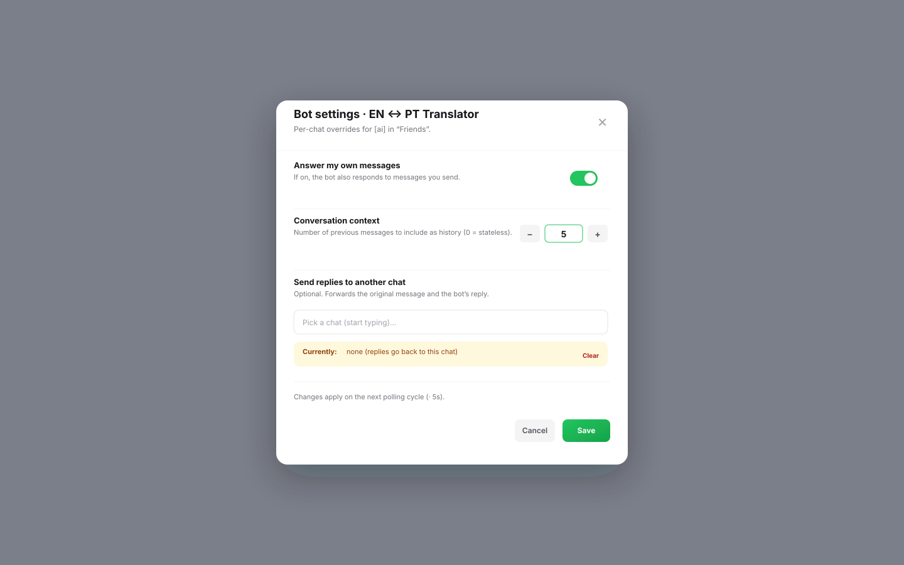

Three knobs:

| Setting | What it does |
|---|---|
| **Answer my own messages** | If on, the bot responds to messages you send too. Off by default for utility bots, useful for translation or coaching. |
| **Conversation context (N)** | Number of previous messages to include as history. `0` = stateless one-shot. Anything above 0 turns on a `call_with_history` LLM call. |
| **Send replies to another chat** | Optional. Forward the original message and the bot's response to a different JID — handy for "summary chats" or admin oversight. |

Click **Save** and the assignment is updated.

**Under the hood:** `PUT /api/bots/{name}/settings?chat_jid=…` with a
JSON body `{ answer_owner_messages, context_message_count,
response_chat_jid }`. The same call is used to clear the redirect (send
an empty string).

---

## Step 7 — Read live logs

Need to know *why* the bot answered the way it did? Open the 📜 button
on any bot card:

  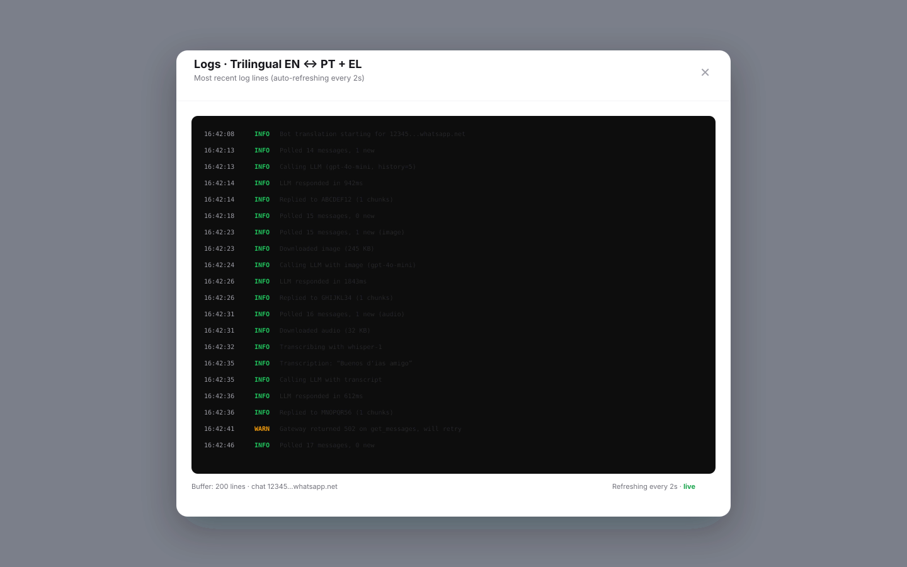

You get the last N entries from a per-bot ring buffer — message arrival,
LLM call timing, send acknowledgements, and anything that errored. Logs
auto-refresh while the modal is open.

**Under the hood:** `GET /api/bots/{name}/logs?chat_jid=…&limit=100`
returns `{ bot_name, chat_jid, logs: [{ timestamp, level, message }] }`.

---

## Step 8 — What it looks like in WhatsApp

Here's the same conversation, viewed inside WhatsApp itself:

  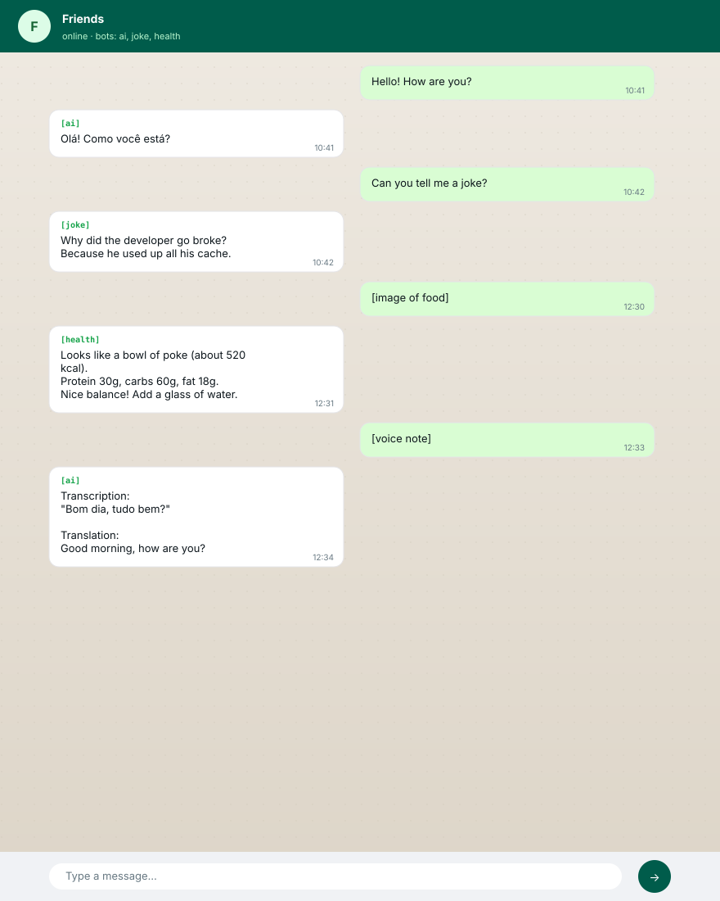

A few things to note:

- Every reply is **prefixed** by the bot's `prefix` (`[ai]`, `[tri]`,
  `[health]`, …). That's also how Whatslang detects "this message came
  from a bot, don't reply to it" and avoids loops.
- Long answers are **split** into ~3500-char chunks with `1/N`, `2/N`
  numbering.
- Voice notes and videos are **transcribed first**, then the bot
  answers based on the transcript (see `MediaMode` in
  [docs/bots.md](docs/bots.md)).
- Image messages flow through a **vision-capable** model call when the
  bot has an `image_prompt`.

---

## Step 9 — Manage the bot catalog

The **Bots** page lists every bot the server knows about and which
chats they're currently active in:

  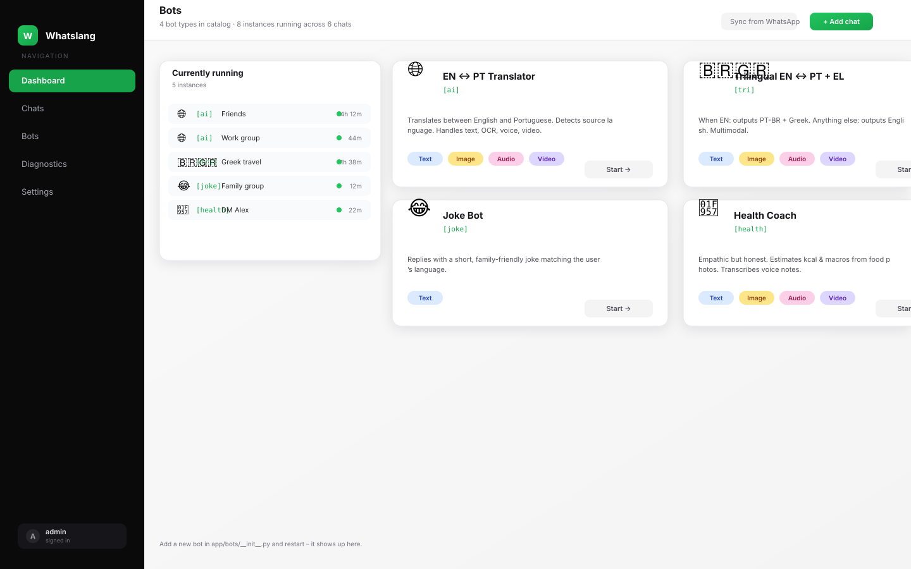

Each catalog card shows:

- The bot's emoji, label, prefix, description.
- Which modalities it supports — text / image / audio / video.
- A **Start** picker so you can assign it to any chat without leaving
  this page.

Catalog content is loaded from `GET /api/bots/types`; running instances
from `GET /api/bots`.

> Want to add a new bot? See [Adding a new bot](README.md#-adding-a-new-bot)
> or the in-depth [docs/bots.md](docs/bots.md).

---

## Step 10 — Diagnostics

  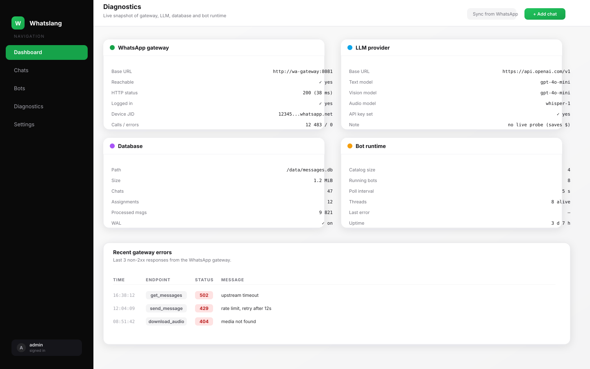

The **Diagnostics** page is your one-stop shop when something looks off.

| Panel | Source |
|---|---|
| WhatsApp gateway | Live probe — base URL, reachability, HTTP status, latency, call count, error count. |
| LLM provider | Config snapshot — base URL, text/vision/audio model names, whether the API key is set. |
| Database | `path`, `size_bytes`, counts of chats / assignments / processed_messages. |
| Bot runtime | Catalog size, currently running bots, polling interval. |
| Recent gateway errors | Ring buffer of the last few non-200 calls with timestamp, endpoint, status, message. |

**Under the hood:** `GET /api/diagnostics` aggregates all of this in one
call so the page can refresh atomically.

> The LLM panel intentionally does **not** fire a probe call — that
> would burn credits on every refresh. To validate your LLM setup, just
> start a bot and watch its logs.

---

## Step 11 — Settings & themes

  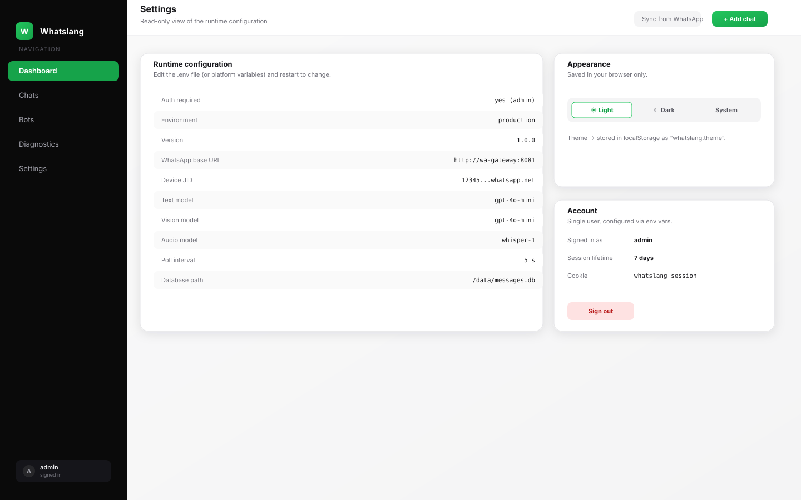

The **Settings** page is read-only and reflects the env-driven runtime
configuration:

- Auth status (enabled / open).
- WhatsApp gateway base URL.
- LLM model names (text / vision / audio).
- Polling interval.
- DB path.
- App version.

It also exposes the **theme switcher** — light, dark, or "system". The
choice is stored in `localStorage` so it survives reloads.

---

## Power tips

- **Drop a bot from "all chats"** — go to **Chats**, filter by
  `Bot status: running`, select-all with the header checkbox, and use
  the **Stop bots** bulk action.
- **A "summary inbox" chat** — start the `health_coach` (or your custom
  bot) in many chats, then point each one's *Send replies to another
  chat* setting at one dedicated DM. Result: a single inbox of all bot
  answers, original message context included.
- **Test prompts without restart** — spin up a `[draft]` bot in one
  test group, iterate on its prompt in `app/bots/__init__.py`, restart,
  and the assignment resumes automatically thanks to the persisted
  `bot_chat_assignments` row.
- **Keep replies focused** — set *Conversation context* to `0` for
  stateless utility bots (translator, joker). Use 5–10 only for chatty
  ones (coach, helper).
- **Backups are trivial** — `make backup` snapshots `data/messages.db`
  to `backups/messages_YYYYMMDD_HHMMSS.db`.

---

## Common workflows

### "I want a translator in every group I'm in"

1. Click **Sync** in the top bar.
2. Open **Chats**, filter `Type: Group`, sort by message count desc.
3. Tick the top N rows.
4. Use the bulk action **Start bots** *(after assigning `translation`
   manually to one chat once — bulk respects the per-chat assignment
   list, see [docs/api.md](docs/api.md#bulk-actions)).*

### "A specific group is too noisy — silence the bot for now"

1. Open the chat detail page.
2. Click **Stop** on the bot card.
3. The thread shuts down within one polling cycle. Re-enable any time
   with **Start** — the assignment row is preserved.

### "I added a new bot, why isn't it in the dashboard?"

The bot catalog is loaded once at startup. Restart the process
(`docker compose restart`, `make docker-restart`, or just re-run
`python -m app`). Live reload is *backend* only — bot specs are read at
import time.

### "I rotated my OpenAI key but bots still error"

Update `OPENAI_API_KEY` in `.env`, then restart. The LLM client is
constructed at app startup. The Diagnostics LLM panel will then show
*API key set: true*; if a bot still errors, its logs show the exact
HTTP status and provider message.

---

## Where to next?

- [docs/bots.md](docs/bots.md) — write your own bot in 10 lines.
- [docs/api.md](docs/api.md) — automate everything via REST.
- [docs/architecture.md](docs/architecture.md) — what happens between
  "user sends message" and "bot replies".
- [docs/troubleshooting.md](docs/troubleshooting.md) — when things go
  sideways.
