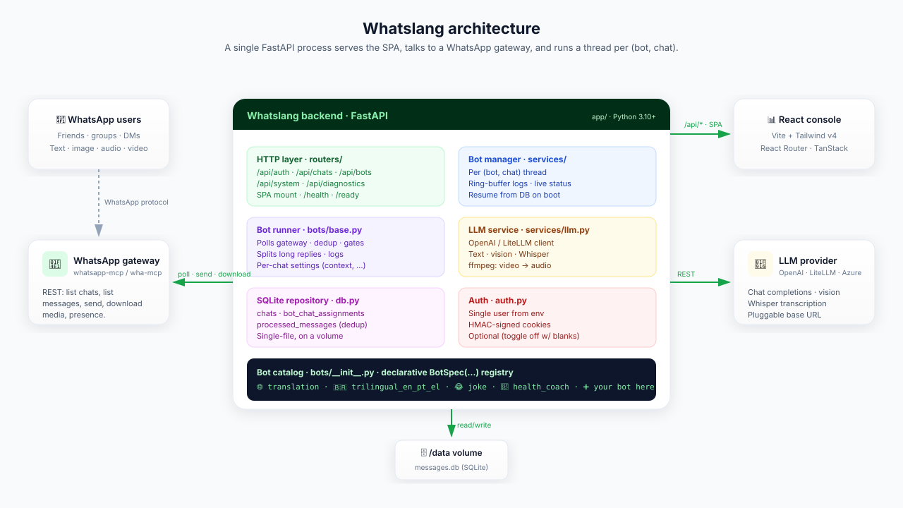
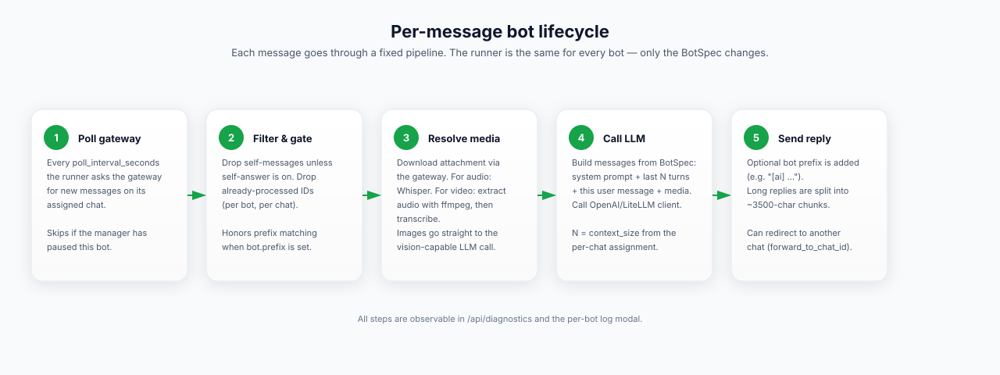

# Architecture

> A single FastAPI process. A single SQLite file. A small thread per
> `(bot, chat)`. That's the whole system.

This page is the "what's *actually* happening?" reference. For the
operator's view see [USAGE.md](../USAGE.md). For configuring it see
[configuration.md](configuration.md). For writing your own bots see
[bots.md](bots.md).

---

## Big picture

<p align="center">
  
</p>

Five things to know about the runtime:

1. **One process.** `app/main.py` is a FastAPI app served by uvicorn.
   It also serves the React SPA from `web/dist` if it's been built.
2. **One database file.** All chat state lives in `data/messages.db`
   (or wherever `DB_PATH` points). It's plain SQLite with WAL mode on.
3. **One LLM client.** `app/services/llm.py` wraps an OpenAI-compatible
   client. Switch providers by changing `OPENAI_BASE_URL`.
4. **One gateway client.** `app/services/whatsapp.py` speaks REST to a
   `whatsapp-mcp`/`wha-mcp`-compatible WhatsApp gateway you bring
   yourself.
5. **One thread per running bot.** The `BotManager` keeps a dict of
   `(bot_name, chat_jid) → BotRunner` and supervises them.

---

## Modules

```text
app/
├── main.py             FastAPI app factory + lifespan + SPA mount
├── config.py           pydantic-settings; the only place that reads env
├── auth.py             HMAC-signed session cookies
├── deps.py             FastAPI Depends(...) providers (singletons)
├── db.py               SQLite repository (WAL, idempotent migrations)
├── schemas.py          Pydantic request/response models
├── logging_setup.py    pretty / JSON logger config
├── routers/
│   ├── auth.py         /api/auth/{status,login,logout}
│   ├── bots.py         /api/bots/{types, , {name}/start|stop|settings|logs}
│   ├── chats.py        /api/chats/...
│   └── system.py       /api/{health, ready, system, stats, diagnostics}
├── services/
│   ├── whatsapp.py     REST client + reachability/error counters
│   ├── llm.py          text · vision · audio (Whisper) · ffmpeg helpers
│   └── bot_manager.py  per-(bot,chat) threads + ring-buffer log handlers
└── bots/
    ├── base.py         BotSpec dataclass · MediaMode enum · BotRunner
    └── __init__.py     register(BotSpec(...))  ← the catalog
```

The frontend is independent:

```text
web/
├── src/
│   ├── api/            typed fetch client per backend resource
│   ├── components/     AppShell, Sidebar, TopBar, primitives
│   ├── lib/            theme, toast, auth context, helpers
│   ├── pages/          Dashboard, Chats, ChatDetail, Bots, Settings, Login
│   └── styles.css      Tailwind v4 + brand color tokens
└── vite.config.ts      Proxies /api to localhost:8000 in dev
```

---

## Process lifecycle

`app/main.py` registers a FastAPI `lifespan` that:

1. Initializes structured logging (`logging_setup.configure_logging`).
2. Opens the database (`Database(settings.db_path)`) and runs idempotent
   migrations.
3. Builds the WhatsApp gateway client.
4. Builds the LLM service client.
5. Builds a `BotManager`.
6. Calls `bot_manager.resume_running_from_db()` — every assignment
   marked `running=1` gets a fresh thread.
7. Optionally seeds the legacy `CHAT_JID` env var as a manual chat.

On shutdown the lifespan calls `bot_manager.stop_all(persist=False)`.
`persist=False` keeps the DB rows untouched so the next boot resumes
the same set.

> **Why a thread per bot?** Each bot polls the gateway on its own
> cadence and must dedup messages independently. Threads are simple,
> cheap, and gunicorn-/uvicorn-friendly. There's no asyncio
> contagion in the bot runner — the gateway client is plain `httpx.Client`.

---

## Per-message lifecycle

<p align="center">
  
</p>

For each tick of `BotRunner._tick`:

1. **Poll** — `WhatsAppClient.get_messages(chat_jid, limit=20)`.
2. **First-run gate** — at startup, the runner *marks* the most recent
   20 messages as already processed so the bot doesn't re-flood the
   chat with answers to old messages. This only happens once per
   `(bot, chat, process)`.
3. **Filter** — drop messages that are:
   - already in `processed_messages` for this bot,
   - empty *and* not media,
   - sent from another bot (start with `[…]`),
   - sent by us **and** `answer_owner_messages` is off,
   - sent by the bot's own device JID.
4. **Resolve media** — for image messages, download via gateway. For
   audio, download then `LLMService.transcribe_audio`. For video,
   download → `extract_audio_from_video` (ffmpeg) → transcribe.
   Hard caps: 100 MB video, 25 MB audio.
5. **Build context** — if the assignment has
   `context_message_count > 0`, fetch the last N messages and pass them
   as a chat history list to the LLM call.
6. **Call the LLM** — `LLMService.call`,
   `LLMService.call_with_history`, or `LLMService.call_with_image`.
7. **Send the reply** — prefix with `BotSpec.prefix`. Split into
   ~3500-char chunks (with `1/N`, `2/N`, … numbering) if needed. Each
   chunk is sent as a reply to the original message ID.
8. **Optional redirect** — if `response_chat_jid` is set, the original
   message is forwarded to the redirect chat first
   (`[Fwd from <name>]: <preview>`), then the reply is sent there
   (without `reply_message_id`).
9. **Mark processed** — write to `processed_messages`. Mostly
   text, length-clamped to 500 chars.

The same path is run by every bot; only the prompts and the media
modes change.

---

## Persistence

```text
chats
  chat_jid (PK)         e.g. 12345@s.whatsapp.net or 1234-5@g.us
  chat_name             friendly name (resolved from gateway when possible)
  is_manual             1 = added by hand, 0 = synced from gateway
  last_synced           timestamp of the last sync
  last_message_time     timestamp of the most recent message we've seen
  message_count         counter, incremented on each handled message
  added_at

bot_chat_assignments
  id (AK)
  bot_name              must match a registered BotSpec.name
  chat_jid              FK → chats(chat_jid) ON DELETE CASCADE
  running               1 = should be a live thread (resumed on boot)
  answer_owner_messages 1 by default
  context_message_count 0 by default
  response_chat_jid     optional redirect target
  created_at
  UNIQUE(bot_name, chat_jid)

processed_messages
  message_id            gateway-provided unique ID
  bot_name              the bot that processed it
  original_text         clipped to 1000 chars
  response_text         clipped to 1000 chars (we then store 500 from BotRunner)
  metadata              free-form e.g. "forwarded_to=…", "startup"
  processed_at
  PRIMARY KEY (message_id, bot_name)
```

WAL mode is on (`PRAGMA journal_mode=WAL`) so reads from the API
threads don't block writes from the bot threads. Each call opens a
fresh connection (`sqlite3.connect(...)`) — cheap and threadsafe.

Two indexes earn their keep:

- `idx_chats_last_message_time` — the dashboard's "recent activity".
- `idx_assignments_running` — `BotManager.resume_running_from_db()`.

---

## Concurrency model

```text
                  ┌──────────────────────────────────────────┐
                  │              uvicorn worker              │
                  │                                          │
                  │   ┌─────────┐     ┌──────────────────┐   │
                  │   │  asyncio│     │ thread pool       │   │
                  │   │  loop   │ ──▶ │ (FastAPI sync     │   │
                  │   │ /api/*  │     │  endpoints + DB)  │   │
                  │   └─────────┘     └──────────────────┘   │
                  │                                          │
                  │   ┌──────────────────────────────────┐   │
                  │   │   BotManager-owned threads       │   │
                  │   │                                  │   │
                  │   │   bot-translation-12345@s...    │   │
                  │   │   bot-joke-12345@s...           │   │
                  │   │   bot-health_coach-67890@g.us   │   │
                  │   │     ⋮                            │   │
                  │   └──────────────────────────────────┘   │
                  └──────────────────────────────────────────┘
```

- HTTP requests are served by FastAPI on the asyncio loop. Sync
  endpoints (most of ours) execute on the default thread pool.
- The bot manager owns a dictionary of threads keyed by
  `(bot_name, chat_jid)`. Adding/removing entries is guarded by a
  `threading.Lock`.
- Each bot thread sleeps `poll_interval * 4 * 0.25s` between ticks so
  shutdowns can interrupt cleanly within ~250 ms.

---

## Logging & observability

- **Structured logger** — `logging_setup.configure_logging` accepts a
  level + format. `LOG_LEVEL=DEBUG` turns up gateway request logging.
- **Per-bot ring buffer** — `BotManager._RingHandler` attaches a
  `logging.Handler` to `logging.getLogger(f"bot.{name}")` for each
  running pair. `GET /api/bots/{name}/logs?chat_jid=…` reads the last
  200 records.
- **Diagnostics endpoint** — `GET /api/diagnostics` is a
  one-shot snapshot meant for the dashboard:
  - WhatsApp probe (`WhatsAppClient.get_app_status`)
  - LLM config (no live probe — saves credits)
  - DB path / size / counts
  - Bot runtime counters
  - Recent gateway errors (last few non-2xx responses)
- **Health probes** — `GET /health` and `/api/health` always return
  `200 OK` once the lifespan finished. Suitable for k8s / Compose
  healthchecks.

---

## Frontend ↔ backend contract

- The SPA only talks to `/api/*`.
- All requests go through a typed fetch client in `web/src/api/` that
  knows about session handling (401 → redirect to `/login`) and toast
  errors.
- Auth state is held in a React context (`web/src/lib/auth.tsx`).
- Theme state is `localStorage`-backed (`web/src/lib/theme.tsx`) with a
  `system` mode that follows `prefers-color-scheme`.
- In dev, Vite proxies `/api` to `:8000` (see `web/vite.config.ts`).
- In prod, FastAPI serves `web/dist/` as static files; the SPA
  fallback route returns `web/dist/index.html` for unknown paths so
  client-side routing works.

---

## Failure modes & limits

| Limit / failure | Where it's handled |
|---|---|
| Gateway down | Each bot tick swallows exceptions and waits one poll interval. The error counter on `WhatsAppClient` increments and surfaces in `/api/diagnostics`. |
| LLM rate-limit / 429 | `_handle` catches and logs, the message is **not** marked processed → it'll retry on the next tick. |
| Message id collision | `processed_messages` PK is `(message_id, bot_name)` so two bots can both answer one message. |
| Long replies | Split into ~3500 char chunks with `i/N` headers. `MAX_MESSAGE_LENGTH = 4095`. |
| Big media | Hard caps in `BotRunner`: 100 MB for video, 25 MB for transcribable audio. |
| Bot loops | Any message that starts with `[xxx]` is skipped (heuristic for "another bot already replied"). |
| Restart safety | `bot_chat_assignments.running` is the source of truth. `BotManager.resume_running_from_db()` rehydrates the world. |

---

## Why this design?

- **One process** because operating two services is twice the toil.
- **SQLite** because the working set is small (chats, assignments,
  recent message ids). Switching to Postgres later is a 200-line
  change inside `db.py`.
- **Threads** because each bot is its own poll loop + LLM call site;
  asyncio would buy nothing here and would complicate the public API
  for custom runners.
- **Declarative bots** because the interesting variable is the prompt,
  not the wiring.
- **Static SPA** so there's no Node runtime in production.
